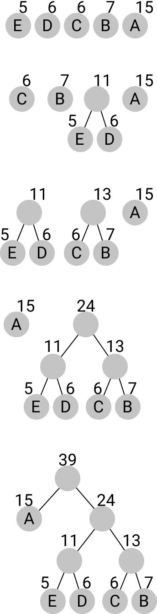

# Huffman Coding

## Einführung

In der ersten Bonuspunkt-Aufgabe sollen Sie ein einfaches Programm zum
komprimieren von Daten erzeugen. Hierzu werden Sie die Huffman-Kodierung
implementieren.

Der Huffman-Algorithmus bekommt einen Text, der aus einer Liste von
Zeichen besteht. Das kann ein String aus Bytes sein, muss es aber nicht.
Nun zählt er, wie oft in diesem Text jedes Zeichen vorkommt und weist
jedem Zeichen eine Bit-Folge zu. Den Zeichen, die häufig vorkommen, gibt
er eine kurze Bit-Folge. Den Zeichen, die weniger häufig vorkommen, gibt
er eine längere Bit-Folge. Hier ein kleines Beispiel:

Nehmen wir an, wir haben einen Zeichensatz von "a", "b", "c" und "d". Wir
können jetzt jedem dieser Zeichen einfach eine 2-Bit-Folge zuweisen

  Zeichen   Repräsentation
  --------- ----------------
  a         00
  b         01
  c         10
  d         11

Wenn wir damit den Text "abaaaaaaaaac" encodieren würden, dann käme
die folgende Bit-Folge raus

    a  b  a  a  a  a  a  a  a  a  a  c  
    00 01 00 00 00 00 00 00 00 00 00 10

    000100000000000000000010

Hierbei handelt es sich um eine offensichtliche Platzverschwendung, da
fast ausschließlich "a"s vorkommen. Hätten wir dagegen die folgende
Kodierung gewählt, könnten wir den Text viel kürzer ausdrücken:

  Zeichen   Repräsentation
  --------- ----------------
  a         1
  b         01
  c         001
  d         000

Hier wird das "a" sehr kurz codiert, die anderen hingegen länger.

    a  b  a  a  a  a  a  a  a  a  a  c  
    1  01 1  1  1  1  1  1  1  1  1  000

    101111111111000

Die Huffman-Kodierung funktioniert nun so, dass sie einen solchen Text
scannt und versucht, die optimale Codierung der Zeichen als Bit-Folgen
zu finden.

Dafür wird für jedes Zeichen ein Knoten angelegt, der sowohl das Zeichen
enthält als auch die Zahl, wie oft das Zeichen aufgetreten ist. Diese
Knoten werden in eine anhand der Frequenz aufsteigend sortierte Liste
gepackt. Der Algorithmus nimmt dann in jedem Schritt die zwei Knoten mit
der kleinsten Frequenz heraus, erstellt einen Eltern Knoten mit dem
kleinsten Knoten als linkes Kind und dem zweitkleinsten Knoten als
rechtes Kind. Die Frequenz des neuen Knotens ist die Addition der
Frequenzen der kleineren Knoten. Dieser neue Knoten wird dann wieder an
der richtigen Stelle der Liste einsortiert. Ganz am Ende bleibt ein
großer Knoten zurück. Das ganze ist in fünf Schritten im folgendem Bild
dargestellt.

Um auf die Bit-Folge zu kommen, die ein Zeichen enkodieren soll, gehen
wir nun einfach im Baum danach auf die Suche. Jedes mal, wenn wir links
abbiegen nehmen wir das Bit 1, jedes mal wenn wir rechts abbiegen nehmen
wir das Bit 0. Damit hat A im Baum oben die Bit-Folge 1, während die D
Bit-Folge 010 hat und B die Bit-Folge 000.

Um eine Bit-Folge zu dekodieren, nehmen wir wieder den Baum und laufen
für jedes Bit den Baum entlang. Die Bit-Folge 10101 entspräche also ADA.

Diese Bit-Folgen kann man jetzt natürlich als Bytes kodieren dann auf
die Platte schreiben. Wenn man dazugehörigen Baum kennt oder auch mit
auf der Platte speichert, hat man einen Kompressionsalgorithmus.

Den Teil mit dem Speichern auf der Platte schenken wir uns, aber das
Bauen des Baumes, das Enkodieren und das Dekodieren wollen wir hier
nachbauen.

## Aufgabenstellung

### Allgemeine Hinweise

-   Die Aufgabe muss funktional, das bedeutet ohne Seiteneffekte
    geschrieben werden. Unter anderem bedeutet das: Benutzen Sie keine
    `var` Variablen, nur `val` Variablen. Rufen Sie außerdem keine
    Methoden auf, die den State von irgendetwas verändern.
-   Es wird in den Aufgaben der Typ `Map` benutzt. Dieser kommt aus der
    Standard-Library. Wenn Sie nicht wissen, wie man damit umgeht, lesen
    Sie dazu den [Eintrag in der offiziellen
    Scala-API-Dokumentation](https://www.scala-lang.org/api/3.1.1/scala/collection/immutable/Map.html)
    oder suchen Sie nach Beispielen im Internet. Prinzipiell funktioniert er
    ähnlich wie Maps oder Dictionaries in anderen Sprachen, jedoch natürlich in
    funktional, d.h. Methoden zum Verändern geben eine neue Map zurück.
-   Auch die anderen Typen in dieser Aufgabe kommen alle aus der
    Standard-Library und nicht aus der Vorlesung. Sie dürfen alle
    Methoden darauf benutzen. Auch hier kann es sinnvoll sein, im
    Internet nach Beispielen oder der Dokumentation zu suchen.
-   Sie können in dieser Aufgabe davon ausgehen, dass alle Typen, auch
    wenn sie generisch sind, in Hash-Maps gepackt und miteinander
    verglichen werden können. Das ist im Allgemeinen nicht so, wird hier
    aber einfach angenommen, damit die Aufgabe nicht unnötig groß wird.
-   Die Aufgabe gilt als bestanden, wenn Sie alle Tests erfolgreich
    bestehen (und der Code funktional ist).
-   Die Tests sind in der Vorlage enthalten, Sie können diese also lokal
    ausführen. Hierzu können Sie ihre IDE / Ihren Editor nutzen, oder in sbt
    den Befehl `test` verwenden.
-   Zur Abgabe laden Sie die bearbeitete Datei "Main.scala" oder Ihren
    Projektordner als Archiv (zip oder tar.gz/tar.xz) hoch.

Um den Baum zu modellieren benutzen wir folgende Datenstruktur:

    enum Node[+A]:
      case Inner(left: Node[A], right: Node[A], freq: Int)
      case Leaf(value: A, freq: Int)
      def freq: Int

Jeder Knoten hat also eine Frequenz und ist entweder ein innerer Knoten
oder ein Blatt. Zu Beginn des Baumbauens haben wir also eine Liste, in
denen nur Blätter sind, welche sich dann langsam in eine Liste mit nur
einem einzigen inneren Knoten wandelt.

Außerdem können einige Fehler passieren, wenn wir den Baum bauen oder
ihn zum enkodieren nehmen. Deswegen repräsentieren wir die möglichen
Fehler in einem Enum:

    enum HuffmanError:
      case NoFrequencies, ValueNotFound, MissingBits

Insgesamt sollen Sie die folgenden vier Funktionen implementieren.

    def getFrequency[A](as: List[A]): Map[A, Int] = ???

Diese Funktion bekommt eine Liste mit Zeichen vom Typ A und liefert eine
HashMap zurück, welche jedem A seine Frequenz zuordnet.

    def createTree[A](freqInfo: Map[A, Int]): Either[HuffmanError, Node[A]] = ???

Diese Funktion bekommt die Frequency-Informationen der vorherigen
Funktion und liefert entweder den NoFrequencies-Fehler zurück, wenn die
übergebene Map leer ist, oder den wie nach obigem Algorithmus
spezifiziert gebauten Baum.

    def encode[A](as: List[A], tree: Node[A]): Either[HuffmanError, List[Boolean]] = ???

Diese Funktion bekommt eine Liste mit Zeichen und einen Baum, und soll
dieses in eine Liste aus Bits (Booleans) enkodieren. Falls ein Zeichen
in der Liste nicht im Baum vorkommt, soll der ValueNotFound Fehler
zurück gegeben werden.

    def decode[A](bits: List[Boolean], tree: Node[A]): Either[HuffmanError, List[A]] = ???

Diese Funktion bekommt eine Liste mit Bits und einen Baum übergeben und
soll diese Liste wieder in eine Liste von As dekodieren. Sollte am Ende
der Liste von Bits ein Zeichen noch nicht fertig dekodiert sein, soll
der MissingBits Fehler zurück gegeben werden.
