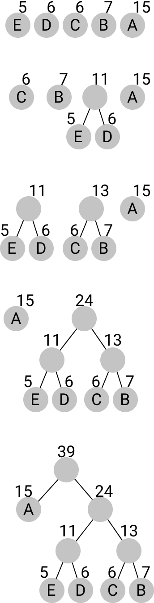

# Huffman Coding

## Introduction

In the first bonus exercise, you are to implement a small program for
compressing Data. For that you will implement the Huffman encoding.

The Huffman algorithm takes a text made up of a list of characters. This can
be a String of bytes, but it needn't be. The algorithm now counts the number
of occurrences of each character in the text and assigns a bit sequence for
each character. The more frequent characters get shorter bit sequences, while
the rarer characters get the longer ones. A small example:

Assuming we have a character set of "a", "b", "c" and "d". We can assign two
bits to each of these characters:

  Char       Representation
  --------- ----------------
  a         00
  b         01
  c         10
  d         11

If we would encode the text "abaaaaaaaaac" with this, we'd get the following
bit sequence:

    a  b  a  a  a  a  a  a  a  a  a  c  
    00 01 00 00 00 00 00 00 00 00 00 10

    000100000000000000000010

This is an obvious waste of space, as we have nearly only "a"s. If we had used
the following encoding instead, the text could be expressed in a much shorter
manner:

  Char      Representation
  --------- ----------------
  a         1
  b         01
  c         001
  d         000

Here "a" is encoded very shortly, while the other characters are longer:

    a  b  a  a  a  a  a  a  a  a  a  c  
    1  01 1  1  1  1  1  1  1  1  1  000

    101111111111000

The Huffman encoding tries to scan a given text to find the optimal encoding
of the characters as bit sequences in it.

For that, it first creates a node for each character, containing the character
and its number of occurrences. These nodes are put into a list, sorted by
ascending frequency. In each step, the algorithm takes the two lowest
frequency nodes and creates a parent node with the smallest node as left child
and the second smallest as right child. The frequency of the parent node is
the sum of the frequencies of the two child nodes. This new node is then put
into the list according to its frequency. In the end a single node remains.
Here is an example with five steps:

To get the bit sequence that should encode a character, we search for it in
the tree. Every time we take a left path we use the bit 1, while for the
right path we use the bit 0. So in the above tree A has the bit sequence
1 while D has the bit sequence 010 and B has 000.

To decode a bit sequence, we again take the tree and walk through it for every
bit in the input. Therefore the sequence 10101 would result in ADA.

Of course, these bit sequences now can be encoded as bytes and written to the
disk. If we know the corresponding tree or store it with the data, we have
a compression algorithm.

We won't do the saving to disk, but will implement the tree creation, encoding
and decoding.

## Task description

### General notes

-   You have to implement the task in a functional way, i.e. without using
    side effects. Among other things, this means: don't use `var` variables,
    only `val`. Don't call methods that change state of anything.
-   The tasks include usage of the `Map` type from the standard library. If
    you are not familiar with its usage, read the [entry in the official Scala
    API documentation](https://www.scala-lang.org/api/3.1.1/scala/collection/immutable/Map.html)
    or look for examples on the internet. It works similarly to maps and
    dictionaries in other languages, but of course in a functional way, i.e.
    methods modifying it return a new map.
-   The other types used in this exercise are also from the standard library
    instead of our implementations from the lecture. You are allowed to use
    any methods they provide. As with `Map`, it can be useful to have a look
    at the documentation or online examples.
-   In this exercise you can assume, that all types, even generic ones, can be
    put into hash maps and be compared with each other. This isn't the case in
    general, but we assume it here to not make the task too big.
-   The task counts as passed, if your implementation passes all tests and is
    written in a functional way.
-   The tests are included in the template, you can run them locally. You can
    use your IDE / editor or run the command `test` in sbt.
-   Submit your implementation by uploading your modified "Main.scala" file or
    pack the whole project folder as an archive (zip or tar.gz/tar.xz)

We use the following data structure to model our tree:

    enum Node[+A]:
      case Inner(left: Node[A], right: Node[A], freq: Int)
      case Leaf(value: A, freq: Int)
      def freq: Int

So every node has a frequency and is either an inner node or a leaf. When we
start building out tree, we have a list containing only leaves, which is
step by step transforming into a list with only a single inner node.

While building the tree or using it to decode or encode, various errors could
occur. We represent the possible errors with an enum:

    enum HuffmanError:
      case NoFrequencies, ValueNotFound, MissingBits

You should implement the following four functions:

    def getFrequency[A](as: List[A]): Map[A, Int] = ???

This function takes a list of characters of type `A` and returns a Map, which
maps from each character to its frequency.

    def createTree[A](freqInfo: Map[A, Int]): Either[HuffmanError, Node[A]] = ???

This function takes the frequency information of the previous function and
either returns the NoFrequencies error, if the given map is empty, or the tree
built like specified in the above algorithm.

    def encode[A](as: List[A], tree: Node[A]): Either[HuffmanError, List[Boolean]] = ???

This function takes a list of characters and a tree, and should encode the
characters into a list of bits (booleans). If a character is not found in the
tree, it should return the error ValueNotFound.

    def decode[A](bits: List[Boolean], tree: Node[A]): Either[HuffmanError, List[A]] = ???

This function takes a list of bits and a tree, and should decode the list of
bits back into a list of As. Should a character be only partially decoded at
the end of the input list, it should return the error MissingBits.
